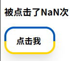
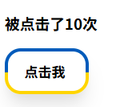
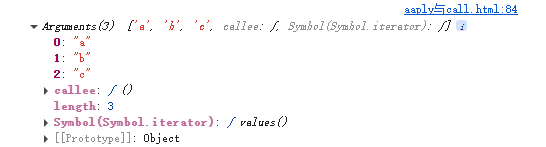
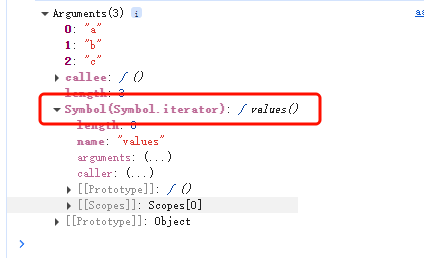
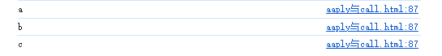

# apply、call、bind

> 此文章需建立在你了解原型链的基础上
>
> 示例均采用原生写法，不使用任何框架

# 先说结论

apply、call这两个方法都是用于**显式绑定函数执行时的**​**​`this`​**​**值**，并**立即调用函数**。它们的返回值是函数的执行结果。它们接受的第一个参数是绑定的上下文(即this)，它们的核心区别在于**自定义参数传递方式**：

call接收的是一个参数列表，形式如：`call(context,'1','3'......)`​

apply接受的是一个参数数组，形式如：`apply(context,['1','3'.....])`​

‍

bind是预先绑定this，并**不会直接调用**，**不支持传入自定义的参数**，它的返回值是一个新的绑定函数

# 模拟场景

我们来模拟一个场景，现在我们的界面上有一个按钮，我想记录这个按钮被点击了几次。

于是我们新建一个构造函数

```js

        <h3 id="btn_count">0</h3>

        
        <button id="btn">
            <span class="button-content">
                点击我
            </span>
        </button>
---------------------------------------------------------------------

const btn = document.getElementById("btn");
const countShow = document.getElementById("btn_count");

function ListenBtn(){
            this.count = 0;

            this.listen = function(){
                this.count++;
                countShow.innerHTML = `被点击了${this.count}次`;
            }
            
        }


        const monitor = new ListenBtn();
        btn.addEventListener("click", monitor.listen);

const monitor = new ListenBtn();
btn.addEventListener("click",monitor.listen)

```

理想情况下，我们会通过此构造函数构造出一个对象，按钮被点击时，将调用对象上的`listen`​方法，显示按钮被点击的次数。

那么我们运行一下，并点击按钮



NaN即Not a Number，这是为什么呢，因为在使用`addEventListener`​时，`mointor.listen`​的上下文(即`this`​)会被定向为btn这个DOM元素，此时访问的`this.count`​实际上就是访问`btn.count`​。

btn上可没有count这个属性。于是就出现了NaN

如果我们使用apply或者call呢？让我们更改一下监听器设置,手动绑定`this`​到`moitor`​上

```js
 btn.addEventListener("click", monitor.listen.apply(monitor));
```

更有意思的事出现了


界面在一开始就显示了被点击了一次，我们再点击也不会有效果了。

**这是为什么？**

还记得上面说的`apply`​和`call`​都会立即调用函数吗，在给btn添加监听器的时候，我们传入的回调函数是一个立即执行的函数，也只会被执行一次。

**那有什么办法解决这个问题呢？**

有的兄弟！有的！还有两种呢！

第一种是通过箭头函数返回，让我们改写一下

```js
 btn.addEventListener("click", () => monitor.listen.apply(monitor));
```

每当我们点击时，箭头函数都会返回`monitor.listen.apply(monitor)`​，因为是立即执行的，所以我们可以达到我们理想的效果



---

第二种方法是使用bind()

```js
 btn.addEventListener("click", monitor.listen.bind(monitor));
```

我们仍然可以实现相同的效果

# 取得apply、call传入的参数

还是上面那个案例，我们稍微改动一下代码，我们可以直接使用`arguments`​来接受传入的参数

```js
function ListenBtn(){
            this.count = 0;

            this.listen = function(){
        
                this.count++;
                console.log(this.count);
          		console.log(arguments)//改动处
          
                countShow.innerHTML = `被点击了${this.count}次`;
            }
            
        }

        const monitor = new ListenBtn();

        btn.addEventListener("click",monitor.listen.call(monitor,'a','b','c'));//改动处
```

运行一下，打开控制台，我们发现输出了这个



> 需要注意的是`arguments`​是一个伪数组，它只是拥有`索引`​和`length`​的对象，所以它不能使用任何数组方法

相比之下，我们可以使用扩展运算符`...`​来将`arguments`​展开为真正的数组，请注意，`...`​只能用于实现了迭代器的数据上。而恰好`arguments`​实现了迭代器



让我们再修改一下代码吧

```js
function ListenBtn(){
            this.count = 0;

            this.listen = function(){
        
                this.count++;
                console.log(this.count);
                const args = [...arguments] //使用扩展运算符包装成真正的数组

                args.forEach((item,index,array)=>{ //调用数组方法forEach
                    console.log(item);
                    
                })
                
                
        
                countShow.innerHTML = `被点击了${this.count}次`;
            }
            
        }

        const monitor = new ListenBtn();

        btn.addEventListener("click",monitor.listen.call(monitor,'a','b','c'));
```

让我们再看一下控制台的输出

Great！



<h1 id="array"> 伪数组、数组、可迭代对象的区别</h1>

## 数组

- 数组继承于`Array.prototype`​，拥有数组的方法如：`push`​、`pop`​

- 数组是可迭代对象

- 数组长度可变，可以通过数字索引访问元素

## 伪数组（Array-Like）

- 伪数组是一个对象，它有length属性和数字索引，但是不继承`Array.prototype`​，不能使用数组方法

- 伪数组可以通过实现`Symbol.iterator`​，让自己变为一个可迭代对象。也就是说伪数组不一定是可迭代对象

## 可迭代对象

- 实现了`Symbol.iterator`​方法的对象
- 可迭代对象可被`for...of`​、`扩展运算符...`​使用
