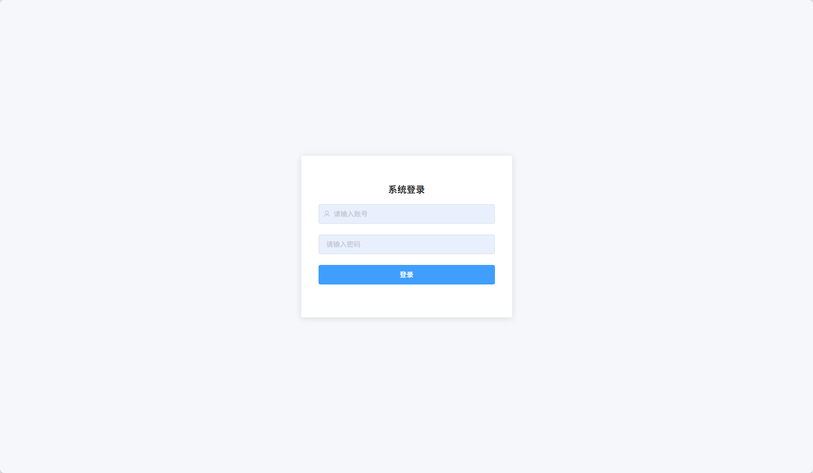
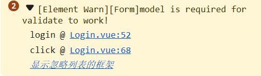
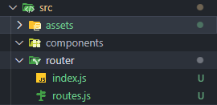

# 操作步骤

# 行动前必看！

请注意，本文档不是线性阅读文档，每一章节都会依赖于上一个需求，岂在最大程度的还原小白在做项目时的思考过程，请在完成初始化后，从初始化Element-UI开始，跟随文档的指引一步步完成项目。

如果能力足够，你也可以任选相应的章节进行阅读。

祝你顺利。现在，请做下面的初始化操作。

# 初始化

```js
vue create admin-train

npm install element-ui

npm install vuex@3   //这个版本是给Vue2用的

npm install vue-router@3  //这个版本是给Vue2用的
```

让我们继续初始化Element-UI  ⬇️

# 初始化Element-UI

[官网说明](https://element.eleme.cn/#/zh-CN/component/quickstart)

**作为一个小白，就要有小白的自知之明，现在的一些略过是为了项目的可持续性**，别倒在了一开始上，所以导入Element-UI，怎么简单怎么来，所以我们直接选择全部导入。

`在src/main.js中`​

```js
import Vue from 'vue'
import App from './App.vue'
import '@/assets/base.css'

import ElementUI from 'element-ui'; //导入全部的element-ui组件
import 'element-ui/lib/theme-chalk/index.css'; //导入element-ui样式

Vue.config.productionTip = false

Vue.use(ElementUI); //注册element-ui插件


const vm = new Vue({
  render: h => h(App),
})


vm.$mount('#app')//挂载

```

这样就可以了，如果你使用的是VSCode，推荐你下载一个针对Element-UI的扩展，会有更好的代码提示


# 登录界面的编写

**在编写登录界面前，请先完成路由的配置：**<a href="#路由初始化">路由初始化</a>

---

在`src`​下新建`views`​文件夹，用于存放我们的页面，登录界面命名为`Login.vue`​

<h3 id="登录界面的编写">分析 </h3>

首先确定最基本的样式，我想要让整个登录表单水平垂直居中显示，只提供最简单的登录功能，布局如下

由此分析，我们只需要**五个元素**即可

- div：最外层包裹，使用flex布局让子元素垂直水平居中
- el-card：包裹form表单，用card是因为这个card比较好看，你也可以使用div进行包裹。


**你会发现input框里面输入不了任何东西，这是因为element-ui规定el-input标签一定要使用`v-model`进行绑定，否则将无法输入。**

我们给用户名绑定变量：userName

我们给密码绑定变量：pswd

最终效果如下

​

### 页面源码解释

<span data-type="text" style="color: var(--b3-font-color13);">这个步骤仅关注界面的编写，仅展示页面的代码</span>

```js
<template>

    <div class="login_container">
        <el-card class="login_card">

            <el-form>
                <h3>系统登录</h3>

                <el-form-item>
					prefix-icon 用于设置输入框的首部icon图标，在官网的文档可以找到详细的说明
                    <el-input v-model="userName" placeholder="请输入账号" prefix-icon="el-icon-user"></el-input>
                </el-form-item>

                <el-form-item>
					加上 show-password 可以在尾部添加显示输入框内容的样式，在官网的文档同样有说明
                    <el-input v-model="pswd" placeholder="请输入密码" show-password></el-input>
                </el-form-item>

                <el-form-item>
                    <el-button type="primary" class="login_btn">登录</el-button>
                </el-form-item>
            </el-form>

        </el-card>
    </div>
</template>

<script>
export default {

    name: 'Login',

    data() {
        return {
            userName:"",
            pswd:""
        }
    },
}

<style scoped> //记得设置scoped，让样式只对次组件生效，保证不会影响到别的组件
/*这个类用于登录界面最外层的div，让内部元素垂直居中*/
.login_container {  
    display: flex;
    justify-content: center;
    align-items: center;
	min-height:100vh;
    height: 100vh;
    background-color: #f5f7fa;
}

/*这个类给el-card组件设置高度、宽度、内边距，这个看个人喜好*/
.login_card {
    width:400px;
    height: 300px;
    padding: 15px;
} 

/*这个类给el-button设置，让按钮的宽度与父容器保持等宽*/
.login_btn{
    width:100%
}
</style>
```

### 写完登录界面框架后下一步该干什么？

整体的登录界面现在已经大体完成了，现在我们需要做的是以下几件事

1. 点击登录按钮后，首先要校验用户名和密码的填写是否符合规范
2. 若符合规范，就通过axios发送http请求，向服务端进行校验是否存在此用户

    1. 若存在，跳转至主页，同时将用户信息存储到SessionStorage中
    2. 若不存在，提示用户用户名或者密码输出错误

于是我们可以提炼出以下步骤，请按照步骤依次跳转观看

1. <a href="#写home界面">写简单的home界面</a>
2. <a href="#写跳转到home界面的路由">写跳转到home界面的路由</a>
3. <a href="#写登录表单校验规则">写登录表单校验规则</a>
4. <a href="#写登录按钮处理函数">写登录按钮处理函数</a>
5. <a href="#配置Mock Server">配置Mock Server</a>（可选观看，您可以直接看第6步，我会提供配置好的Mock Server环境)
6. <a href="#Axios配置">Axios配置</a>
7. <a href="#使用封装的API进行登录校验">使用封装的API进行登录校验</a>

<h4  id="写home界面"> home界面</h4>

在`src/views/`​下新增`AppHome.vue`​文件，文件内容如下

```js
<template>
    <h1>This is Home Page!</h1>
</template>
```

**请继续向下阅读「编写跳转到home界面的路由条目」** 

<h4 id="写跳转到home界面的路由"> 编写跳转到home界面的路由条目</h4>

在`src/router/routes.js`​中新增跳转到home界面的路由

**动态导入组件**

```js
const routes = [
    {
        path: '/',
        redirect: "/login"
    },
    {
        path:'/login',
        component: () => import('@/views/Login.vue')
    },
    { //添加到跳转至Home界面的路由规则
        path:'/home',
        component: () => import('@/views/AppHome.vue'),
    }
]


export default routes;
```

**静态导入组件**

```js
import AppHome from '@/views/AppHome.vue'

    { //添加到跳转至Home界面的路由规则
        path:'/home',
        component: AppHome,
    }
```

<h4 id="写登录表单校验规则">登录表单校验规则</h4>

回到 `src/views/Login.vue`​文件，让我们看一下Element-UI官网是如何说的：

> Form 组件提供了表单验证的功能，只需要通过 `rules`​ 属性传入约定的验证规则，并将 Form-Item 的 `prop`​ 属性设置为需校验的字段名即可。校验规则参见 [async-validator](https://github.com/yiminghe/async-validator)

通过`rules`​传入的应是一个对象，这个对象中的每个键名都代表着一个`input`​的校验规则，而这个键的值是一个对象数组，每一个对象都对应着一个校验方式，常见的校验规则有如下几种。

|规则属性|说明|
| ----------| ------------------------------------|
|​`required`​|是否必填（值为 `true`​ 或 `false`​）|
|​`message`​|校验失败时的提示信息|
|​`trigger`​|触发校验的时机（`'blur'`​、`'change'`​ 或 `['blur', 'change']`​）|
|​`min`​/`max`​|字符串 / 数组长度限制|
|​`len`​|精确长度|
|​`pattern`​|正则表达式校验|
|​`validator`​|自定义校验函数（参数：`rule`​, `value`​, `callback`​）|
|​`asyncValidator`​|异步校验函数（返回 Promise）|

---

1.新增一个变量`rules`​，这个你可以取任意名字

```js
对于用户名和密码，我们希望这是必填的
对于用户名，我们可能会禁用一些特殊字符，只允许填写数字、字符，还要限制一定的长度
对于密码，我们希望密码有一个最小长度和一个最大长度
根据以上需求，我们可以这样编写校验规则
data() {
        return {
            userName:"",
            pswd:"",
            rules: {
               userName:[
                {required:true, message:"账号不能为空", trigger:"blur"}, //必填的
                {mix:1, max:20, message:"长度只能在1-20个字符",trigger:"blur"}, //规定校验的长度
				//使用正则匹配规定输的只能在字母和数字的组合
                {pattern:/^[A-Za-z0-9]+$/, message:"账号只能是字母和数字的组合",trigger:"blur"} 
				],
               pswd:[
                {required:true, message:"密码不能为空", trigger:"blur"},// 必填的
                {mix:6, max:20, message:"密码长度至少为6位或至多为20位",trigger:"blur"}, //规定密码的校验长度
               ]
            }

        }
    },
```

2. 应用校验规则

```js
 <el-form :rules="rules"> //使用v-bind绑定校验规则对象
                <h3>系统登录</h3>

                <el-form-item prop="userName"> //设置需要校验的规则名
                    <el-input v-model="userName" placeholder="请输入账号" prefix-icon="el-icon-user"></el-input>
                </el-form-item>

                <el-form-item prop="pswd"> //设置需要校验的规则名
                    <el-input v-model="pswd" placeholder="请输入密码" show-password></el-input>
                </el-form-item>

                <el-form-item>
                    <el-button  @click.prevent="login" type="primary" class="login_btn">登录</el-button>
                </el-form-item>
</el-form>
```

<h4 id="写登录按钮处理函数">给el-button​设置回调函数</h4>

```js
<el-button  @click.prevent="login" type="primary" class="login_btn">登录</el-button>

methods:{
	login(){
		alert("你点击了登录按钮")
	}
}
```

现在让我们不输入任何东西，点击一下登录按钮


按钮的方法居然被触发了！这是因为Element-UI 的表单校验**不会自动阻止**按钮事件执行，需要在按钮点击回调中**主动调用校验逻辑**，并根据校验结果控制后续流程。查看官方文档，我们可以发现`el-form`​组件上有一个方法`validate`​可以判断校验的结果


让我们重写回调函数

```js
如果要使用 validate 方法，我们就需要获取到表单的元素，在Vue中我们可以使用ref来获取到元素，并使用this.$refs来访问该元素
首先让我们获取到这个表单元素，在el-form上添加ref，命名为loginForm
<el-form :rules="rules" ref="loginForm">

然后让我们重写登录的回调函数
methods: {
        login(){
            this.$refs.loginForm.validate((isValid)=>{
                if(isValid){
                    alert('验证通过')
                }else{
                    alert('验证失败')
                }
            })
        }
    }
```

再让我们试一下，你会发现点击之后没有任何弹窗，控制台输出了下图，这是为什么呢？看不懂英文没关系，直接扔给AI，让AI帮你分析，经分析得知，这个错误提示表明你的表单校验失败是因为缺少 `model `​属性。Element-UI 的表单校验依赖于 model 来绑定数据，必须在` <el-form>`​ 上**显式指定 :model**。让我们再翻看一下官网的文档，看看model是如何绑定的



经过查询得知，model的意义就是告诉表单组件，你应该去验证哪些数据，这些数据应该和`el-input`​通过`v-model`​绑定的数据一致。

而校验规则对象的键名也要和绑定的数据变量名一致；让我们修改我们的代码

```js
首先修改标签
<el-form :rules="rules" :model="ruleForm" ref="loginForm"> //添加model绑定的数据对象
                <h3>系统登录</h3>

                <el-form-item prop="userName">
						//重新设置v-model的值为数据对象中的userName变量
                    <el-input  v-model="ruleForm.userName" placeholder="请输入账号" prefix-icon="el-icon-user"></el-input>
                </el-form-item>

                <el-form-item prop="pswd">
						//重新设置v-model的值为数据对象中的pswd变量
                    <el-input v-model="ruleForm.pswd" placeholder="请输入密码" show-password></el-input>
                </el-form-item>

                <el-form-item>
                    <el-button  @click.prevent="login" type="primary" class="login_btn">登录</el-button>
                </el-form-item>
</el-form>


现在我们的删掉了userName 和 pswd 这两个变量，创建了ruleForm对象，并向对象中添加了 userName 和 pswd 属性。

 data() {
        return {
            ruleForm:{
                userName:"",
                pswd:""
            },
            rules: {
               userName:[
                {required:true, message:"账号不能为空", trigger:"blur"},
                {mix:1, max:20, message:"长度只能在1-20个字符",trigger:"blur"},
                {pattern:/^[A-Za-z0-9]+$/, message:"账号只能是字母和数字的组合",trigger:"blur"}
               ], 
               pswd:[
                {required:true, message:"密码不能为空", trigger:"blur"},
                {mix:6, max:20, message:"密码长度至少为6位或至多为20我位",trigger:"blur"},
               ]
            }

        }
    },

```

请你再试一下，我们现在的代码就可以正常执行了

如果您不想看如何配置Mock Server，您可以直接跳转至 Axios配置，不会影响您的学习

<h4 id="配置Mock Server">Json Server配置</h4>

[json-server的github主页](https://github.com/typicode/json-server/tree/v0)

`json-server`​ 可以让前端人员不用去编写后端的代码，就能在本地搭建一个 `json`​ 服务，可用于测试一些业务逻辑，便于调试调用，可以使用中间件去实现一些逻辑处理。并且可以将数据更新实时的保存到本地文件中。

---

> 其实这东西我也没有用过，可能是用的人太少了，资料也不好找，鼓弄半天总算是搞明白怎么用了，不如我直接用FastAPI去写接口.....

首先让我们**全局**安装json-server，不要下载最新的，最新的不支持一些语法。

```cmd
npm install -g json-server@0.17.4
```

在`src`​目录下新建`jsonServer`​文件夹，并在此文件夹下新建两个文件：

- `db.json`​：模拟数据的来源
- `middleware.js`​：用来自定义处理请求的中间件

```json
db.sjon的规范如下
{
  "users": [
    {
      "id": 1,
      "name": "admin",
      "account": "admin",
      "password": "123456"
    },
  ]
}
```

```js
middleware.js文件需要返回一个函数
这个函数接受三个参数request、response、next，分别是请求对象，响应对象，执行下一个中间件的方法
next就先别管了，在文件的最末尾写一个就行
规范如下

//需要注意的是，这里引入模拟的数据文件需要使用CommonJS规范来引入
const db = require("./db.json");

module.exports = (req, res, next) => {
  // 这里用来写登录逻辑的实现，详情请看我的源码是如何写的

  // 如果不匹配以上的路由，继续下一个中间件
  next();
};

```

启动服务：`json-server --watch .\src\jsonServer\db.json --middlewares .\src\jsonServer\middleware.js --port 9088`​

来解释一下上面的命令：

- 启动了一个json-server服务，同时监察db.json这个文件的数据变化，以便于能够同步变化到文件中；
- 使用中间件对路由进行处理。
- 在本地的9088端口开启服务

我已经将此命令写为脚本了放在`package.json`​中了，使用`npm run mock`​即可启动

具体的一些实现我会写在源码中，真心不建议用着东西写接口，有能力的朋友们还是学学`FastAPI`​​吧，写接口更快😫。

<h4 id="Axios配置"> Axios配置</h4>

[起步 | Axios中文文档 | Axios中文网](https://www.axios-http.cn/docs/intro)

Axios 是一个基于 `Promise `​ 的网络请求库，作用于`node.js`​ 和浏览器中。 它是 *isomorphic* 的(即同一套代码可以运行在浏览器和node.js中)。在服务端它使用原生 node.js `http`​ 模块, 而在客户端 (浏览端) 则使用 XMLHttpRequests。

**安装axios**

```js
npm install axios
```

axios的使用是比较简单的，但是这建立在你理解http协议的基础上，但是你不理解http也没关系，我相信你很聪明，你可以理解整个流程的。

对于Axios，你可以导入之后直接使用，也可以封装一下，但是最好还是封装，便于以后管理

首先在`src`​文件就下新建`utils`​文件夹或者`includes`​文件夹，这类文件夹在工程中的意思是外部的工具，用于存放第三方库的工具或者自己封装的工具，然后再在`src`​下新建一个`api`​的文件夹，用于存放我们的`api`​


我们在`utils`​下新建一个名为`requests.js`​的文件，这个文件用来封装axios实例。以下是此文件的内容

具体的配置内容可以访问：[请求配置 | Axios中文文档 | Axios中文网](https://www.axios-http.cn/docs/req_config)

```js
import axios from 'axios' //导入axios

const request_instance = axios.create({ //使用create创建一个axios实例，并配置基础url
    baseURL: 'http://127.0.0.1:9088',
    timeout: 5000,//请求超时时间为5000毫秒
})

export default request_instance; //导出axios实例
```

当你看配置文件，你会发现有这样一段描述


时现在我们来稍微讲解一下`baseURL`​和`url`​的作用

当我们使用axios去访问一个api时，通常是这样的：`axios.get('http:/127.0.0.1:9088/getUsers')`​或者是`axios.get('/getUsers)`​

axios会自动识别你的请求路径，当你采用`axios.get('http:/127.0.0.1:9088/getUsers')`​这种写法时，即使你配置了`baseURL`​，也会去请求你填入的完整地址，但当你采用`axios.get('/getUsers)`​这种写法时，axios会识别到你只填入了一个请求路径，而不是一个完整的请求地址，在发起请求时，axios会自动拼接，最终的路径是baseURL+你传入的请求路径，以上面的请求为例，我们的请求最终会被拼接为：`http://127.0.0.1:9088/getUsers`​

---

打开`api`​文件夹，在此文件夹下新建一个`api.js`​文件，用于封装我们自己的API

```js
import axios from '@/utils/requests.js'

// 登录验证
const vali_login = (account, password) => { 
//axios是基于promise的库，axios的请求都会返回一个Promise对象
//在此接口请求中，我们实际返回的是一个Promise对象
    return axios.post('/login',{
        account,
        password,
    });
}

export {
    vali_login,
}
```

---

<h4 id="使用封装的API进行登录校验">登录校验与路由跳转</h4>

下面我们把登录接口应用到登录按钮上

我们想要实现什么效果呢？

1. 点击登录按钮后如果验证不通过，弹窗提示“用户名或密码错误”
2. 点击登录按钮后如果验证通过，跳转到主页，并弹窗提示“登录成功”

为了弹窗好看些，我们使用Element-UI提供的`Message`​用于提醒[具体用例请看这](https://element.eleme.cn/#/zh-CN/component/message)

Element 注册了一个$message方法用于调用，Message 可以接收一个字符串或一个 VNode 作为参数，它会被显示为正文内容。

我们回到`Login.vue`​这个文件，在`<script>`​标签下解构导入`vali_login`​，

‍

```js
<script>
import { vali_login } from "@/api/api.js"
```

再改变原来的登录按钮点击方法，获取用户输入，传入至封装的请求函数，最后我们的登录函数是这样的

> 记得在测试功能前先把json-server服务开启，使用npm run mock即可开启

> 这部分需要了解Promise，如果您不了解，请看：[Promise - JavaScript | MDN](https://developer.mozilla.org/zh-CN/docs/Web/JavaScript/Reference/Global_Objects/Promise)

```js
        login() {
            this.$refs.loginForm.validate((isValid) => {
                if (isValid) {//表单验证通过
                    // 调用登录接口，传入接口需要的参数
                    vali_login(this.ruleForm.userName, this.ruleForm.pswd)
						//当服务器响应的HTTP状态码是正常的情况下（2XX），会调用then中的处理逻辑
                        .then(res => {
							//axios会将响应封装，服务器返回的数据都会放入res.data中
                            if (res.data.code === 200) {
								//设置Message提示框
                                this.$message({
                                    message: "登录成功",
                                    type: "success",
                                    duration: 1500 //设置提示框显示时间为1500毫秒，默认为3000毫秒
                                })
								//进行路由跳转，注意，这里使用的是路由器实例：this.$router,不是$route
								//使用路由路径跳转
                                this.$router.push({ path: "/home" });
                            }
                        })
						//当服务器响应的HTTP状态码是异常的情况下(4XX-5XX),会调用catch中的处理逻辑
                        .catch(err => {
                            this.$message({
                                message: "用户名或密码错误",
                                type: "error"
                            })
                        })

                } else {
                    return;
                }

            })

        },
```

好了，整体的登录功能现在我们已经完成了，这部分如果想看的更懂，请自行了解
- [Promise](./异步编程.md)
- [HTTP协议](./简单的HTTP协议应用.md)
- axios的请求配置与响应结构

下面让我们来专注Home界面的编写吧，继续向下看吧！加油，开头总是困难的，后面的路会更好走。

# 编写Home界面

后台管理基本上的界面都长一个样，如下图所示


所以我们要分析我们的主页要展示什么，就是这样

​

Element-UI提供了多种**布局容器**供我们选择，其中我们想要的是这一种


先看一下Element-UI对于布局容器的介绍：

用于布局的容器组件，方便快速搭建页面的基本结构：

`<el-container>`​：外层容器。当子元素中包含 `<el-header>`​ 或 `<el-footer>`​ 时，全部子元素会垂直上下排列，否则会水平左右排列。

`<el-header>`​：顶栏容器。

`<el-aside>`​：侧边栏容器。

`<el-main>`​：主要区域容器。

`<el-footer>`​：底栏容器。

<span id="这个地方"></span>以上组件仅有`<el-container>`​采用了 **flex**  布局，即渲染出来只有`el-container`​是`display:flex`​，剩下的四种组件渲染出来都是`display:block`​，但是这四个组件做为flex布局的子项使用。

> 如果你是第一次看到这，请忽视下面这个链接，继续向下看
> 返回观看：<a href="#头像">头像组件的编写</a>

使用前请确定目标浏览器是否兼容。此外，`<el-container>`​ 的子元素只能是后四者，后四者的父元素也只能是 `<el-container>`​。

---

于是我们就可以确定下基本的框架了，打开`src/views/AppHome.vue`​文件，先在Element-UI官网上找到对应的代码，把框架填充上

```js
<template>
    <!-- 最外层容器 -->
    <el-container>
        <!-- 侧边栏 -->
        <el-aside width="200px">Aside</el-aside>

        <!-- 主内容区域，包括头部和主内容 -->
        <el-container>
            <el-header>Header</el-header>
            <el-main>Main</el-main>
        </el-container>
        
    </el-container>
</template>
```


这样看着不明显，我们再加点CSS样式，添加点背景色，设置下最外层容器的宽度

```js
<template>
    <!-- 最外层容器 -->
    <el-container class="outermost_container">
        <!-- 侧边栏 -->
        <el-aside width="200px"
        class="sidebar"
        >Aside</el-aside>

        <!-- 主内容区域，包括头部和主内容 -->
        <el-container>
            <el-header
            class="page_header"
            >Header</el-header>
            <el-main
            class="page_main_content"
            >Main</el-main>
        </el-container>

    </el-container>
</template>


<style scoped>

.outermost_container {
    /* 设置最外层容器的宽度为100%
        最小高度为视窗高度
        高度为视窗高度
    */
   width: 100%;
   min-height: 100vh;
   height: 100vh;

}
.sidebar {
    background-color: #ffa8a8;
}
.page_header {
    background-color: #748ffc;
}
.page_main_content{
    background-color: #38d9a9;
}
</style>
```

Great！运行一下，你现在看到的是这样的界面，是不是有内味了。


在element-ui中，很多组件都有自己默认的witdh、height、padding、margin等类型，这可能不是我们想要的，所以我们要自己修改样式，

OK，下面就要开始微操了

- 调整侧边栏的宽度为合适的宽度，我这里设置为 300px
- 调整header的高度为合适的高度，我这里设置为了 80px

当你改完后，你会发现样式没有生效，简单粗暴，直接在后面加上`!important`​，`!important`​ 是一个特殊的声明，用于**强制提高特定样式规则的优先级，还有一种方法就是在标签内写行内样式，这种样式的优先级是最高的，但是行内样式写的多了不好维护。**

最终的CSS如下

这边要说一下，style标签上有一个`scoped`​，在 Vue 组件中，`<style scoped>`​ 是一个特殊的属性，用于限制 CSS 的作用域，使样式仅应用于当前组件。**这是框架带来的特性，并不是CSS的原生特性**

```css
<style scoped>

.outermost_container {
    /* 设置最外层容器的宽度为100%
        最小高度为视窗高度
        高度为视窗高度
    */
   width: 100%;
   min-height: 100vh;
   height: 100vh;

}
.el-aside {
    width:300px !important;
    background-color: #ffa8a8;
}
.page_header {
    background-color: #748ffc;
    height: 70px !important;
}
.page_main_content{
    background-color: #38d9a9;
}
</style>
```

## 编写logo组件界面

接下来就是logo了，谁不想把自己的logo放在最显眼的地方🤣；左上角这个位置是logo的常用位置。

那我们分析一下我们需要什么？

1. 我们需要一个logo图片和一个说明文字
2. 我们需要图片和说明文字都要水平垂直居中

---

上面提到过，布局容器类的组件都采用了flex布局，所以不需要额外设置flex了

修改组件，添加一个div作为logo图片和标题说明的容器

```css
<el-aside width="200px" class="sidebar">
            <div class="logo">
                
                <span>XX管理系统</span>
            </div>

        </el-aside>
```

直接展示logo组件的CSS样式吧，CSS是个非常考验人的技术活，得有点审美，我也就随便找个配色

```css
<style scoped>
.outermost_container {
    /* 设置最外层容器的宽度为100%
        最小高度为视窗高度
        高度为视窗高度
    */
    width: 100%;
    min-height: 100vh;
    height: 100vh;

}

.el-aside {
    width: 300px !important;
    background-color: #232946;
}

.page_header {
    background-color: #fffffe;
    height: 80px !important;
}

.page_main_content {
    background-color: #38d9a9;
}

.logo {
	/*对logo容器使用flex，设置元素水平垂直居中对齐，
	设置高度和header组件高度相同，保持视觉统一 */
    display: flex;
    justify-content: center;
    align-items: center;
    width: 100%;
    height: 80px;
    background-color: #232946;

}
.logo>img {
    width: 50px;
    height: 50px;
}
.logo>span{
    color:#fffffe;
    margin-left: 10px;
}
</style>
```

> 如果嫌麻烦，像.logo>img这个地方可以直接设置行内样式，毕竟很少再动了

OK，logo组件完成了，接下来是菜单

## 编写menu组件界面

我们来分析一下，我们需要什么样的菜单？

1. 这个菜单需要显示在侧边栏这里，所以它应该是垂直的
2. 这个菜单需要有多级菜单

---

同样的，Element-UI也提供了非常丰富的菜单组件：[Menu组件](https://element.eleme.cn/#/zh-CN/component/menu)

我们选用垂直菜单，menu组件默认就是垂直的，也可以设置水平，具体配置项可查看官方文档，就是上面的链接。


这部分我会设计到**单菜单选项**和**二级菜单选项**，至于分组菜单先不讨论，也很简单，以下是elment-ui关于菜单的组件

- el-menu：最外层的菜单容器

  - **以下是该组件的常用重要属性**
  - `default-active`​：当前激活菜单的index
  - `default-openeds`​：当前打开的sub-menu的index的数组
  - `router`​：是否使用 vue-router 的模式，启用该模式会在激活导航时以 index 作为 path 进行路由跳转
- el-submenu：二级菜单

  - **以下是该组件的常用重要属性**
  - `index`​：唯一标志
- el-menu-item：菜单项（最小选择单元）

  - **以下是该组件的常用重要属性**
  - `index`​：唯一标志

‍

首先设计一下我们的菜单项目应该有什么，为了最简化学习，菜单我只会设置一个首页菜单和一个系统管理，结构如下

- 首页
- 系统管理

  - 用户管理（管理当前系统的用户）
  - 角色管理（赋予当前系统的角色权限）

让我们在`AppHome.vue`​文件中继续编写我们的菜单，菜单的组件需要放在logo的下面

> 你可以在这里找到关于icon的类名：[icon](https://element.eleme.cn/#/zh-CN/component/icon)

```css
<!-- 菜单 -->
			<!-- default-active可以指定默认被激活的菜单，当有其他菜单被激活时，该值会动态更新为被激活菜单的index -->
            <el-menu default-active="/home"> 
                <!-- 首页 -->
                <el-menu-item index="/home">
					<!--这是使用了插槽传入了一个组件，设置了一个icon图标和标题名，如果你不想设置icon图标，直接写一个标题就行 -->
                    <template slot="title">
                        <i class="el-icon-s-home"></i>
                        <span>首页</span>
                    </template>
                </el-menu-item>

                <!-- 系统管理 -->
                <el-submenu index="/systemPage">
                    <template slot="title">
                        <i class="el-icon-setting"></i>
                        <span>系统管理</span>
                    </template>
                    <!-- 用户管理 -->
                    <el-menu-item index="/userPage">
                        <template slot="title">
                            <i class="el-icon-user"></i>
                            <span>用户管理</span>
                        </template>
                    </el-menu-item>

                    <!-- 角色管理 -->
                     <el-menu-item index="/rolePage">
                        <template slot="title">
                            <i class="el-icon-star-on"></i>
                            <span>角色管理</span>
                        </template>
                     </el-menu-item>
                </el-submenu>

            </el-menu>
```

Great！现在运行一下，你看到的应该是这样的界面


这太丑了，让我们来改一下样式，这里我们就不使用`!important`​了，我们使用深度选择`:depp()`​，深度选择并不是CSS原生的，需要配合着框架使用。

至于这些类名是怎么来的，运行后按F12打开浏览器控制台看对应元素的类名吧。一般来说，Element-UI的组件在被渲染后，它会拥有一个和它组件名相同的类名，例如`<el-menu></el-menu>`​被渲染后，这个元素中就存在一个`el-menu`​类

```css
:deep(.el-menu) {
	/* 这个不加可能会导致边框和菜单项有0.8px的宽度差距，强迫症狂喜*/
    border: none;
}
:deep(.el-aside) {
	/* 禁用el-aside的滚动条*/
    overflow: hidden;

}

/* 深度选择：选择二级菜单的类名，设置文字大小为18px 
    设置文字左对齐
*/
:deep(.el-submenu__title) {
    text-align: left;
    font-size: 18px;
    color: #fffffe;
    background-color: #232946;
}

/*  深度选择：选择二级菜单的类名，设置文字大小为18px
    设置文字左对齐
*/
:deep(.el-menu-item) {
    color: #fffffe;
    text-align: left;
    font-size: 18px;
    background-color: #232946;
}

:deep(.el-menu-item.is-active){
    /* 设置单个菜单被激活时样式 */
    color: #eebbc3;
}

```

现在看起来好多了


Great！下一步就是编写我们的header组件.

## 编写header组件界面

让我们一起来分析一下，我们的header组件需要什么呢？（点击下方链接跳转观看）

1. 左侧有<a href="#面包屑">面包屑</a>，面包屑需要随着点击的菜单同时变化，若点击到了二级菜单选项，在面包屑中的二级菜单则不能被点击。

    1. 例如我点击了系统管理下的用户管理，面包屑应该为` 首页 / 系统管理 / 用户管理`​，其中首页和用户管理都可以点击进行路由跳转，系统管理不需要跳转，因为二级菜单项只提供一个展示。
2. <a href="头像和个人设置">右侧有头像框和个人设置</a>

    1. 头像框需要圆形的
    2. 个人设置为一个齿轮小图标，点击可以跳转到设置界面或者是弹出一个模态框进行修改 **(为了覆盖足够多的组件使用，我选取使用模态框。)**

‍

---

首先是面包屑：[面包屑组件](https://element.eleme.cn/#/zh-CN/component/breadcrumb)

<span id="面包屑">面包屑就是这种东西，为了提高用户体验而生的</span>


下面是面包屑相关的组件

- el-breadcrumb：面包屑的最外层组件

  - 存在`separator`​属性可以设置分隔面包屑的字符串，也只能填入字符串，默认为`"/"`​
  - 存在`separator-class`​属性可以设置相应的icon作为分隔符，存在此属性时，`separator`​将会失效
- el-breadcrumb-item：面包屑组件内的子项

  - 存在属性`to`​，用于定义路由跳转对象，如同`vue-router`​中的`to`​
  - `replace`​：在使用to进行路由跳转时，启动replace将不会向history添加新纪录，默认值是false。


---

现在我们回到`AppHome.vue`​这个文件，在el-header下面新增

```html
<!-- 面包屑 -->
<el-breadcrumb separator="/">
      <el-breadcrumb-item :to="{ path: '/home' }">首页</el-breadcrumb-item>
      <el-breadcrumb-item><a href="/">活动管理</a></el-breadcrumb-item>
      <el-breadcrumb-item>活动列表</el-breadcrumb-item>
      <el-breadcrumb-item>活动详情</el-breadcrumb-item>
</el-breadcrumb>
```

```css
//对应的CSS样式
这段CSS样式选择了面包屑的容器，设置了一下字体大小为18px，将容器高度和行高都设置与header等高，这样会使得文字垂直居中
*tip：如果有能力的话，可以看一看sass或者less，它们是CSS的增强语言，可以在CSS定义变量、函数等操作。为了让小白能看懂，
我们还是直接写CSS吧

:deep(.el-breadcrumb){
    font-size: 18px;
    height: 80px;
    line-height: 80px;
}
```

---

<span id="头像和个人设置">接下来我们来看一下头像和个人设置相关的组件</span>

分析一下

1. 头像直接使用element-ui提供的组件
2. 个人设置可以使用i标签设置为icon

---

让我们使用`el-avatar`​组件来设置头像，点击此处观看官方文档： [Avatar](https://element.eleme.cn/#/zh-CN/component/avatar)

让我们在`</el-breadcrumb>`​下面添加一个div标签，作为头像和个人设置的父容器


```css
<div class="right_header">
    <el-avatar shape="square" :size="50" :src="require('@/assets/头像.png')"></el-avatar>
    <i class="el-icon-setting"></i>
</div>
```

```css
//CSS 样式
.right_header{
   display: flex;
   justify-content: center;
   align-items:center; 
}
.right_header>i{
    margin-left: 20px;
    font-size: 20px;
    cursor:pointer; //设置鼠标放上去的样式为pointer，就是个小手一样的图标
}
```

Great!,现在让我们来看一下界面


和我们预想中的不太一样呢😯，这是为什么呢，不知道你有没有注意到<a href="#这个地方">这个地方</a>，我说了el-header会被渲染成block，而不是flex布局。所以让我们对el-header重新修改一下吧，把它的布局改为flex并稍加调整
<span id="头像"><span>

```css
:deep(.el-header) {
    display: flex;
    justify-content: space-between; //主轴上的子元素首尾贴近容器边框，剩下的子元素平分剩余空间
    align-items: center; //交叉轴上的元素对齐方式为居中
    padding: 0 40px; //设置内边距为上下0px，左右40px
}
```

Great，现在我们的界面是我们想要的样子了


## 点击菜单同步面包屑

Great！看到这里我真得夸夸你了，你很棒，你比大多数人都能坚持下来，请记住这就是你做了非常成功的一件事，坚持这件事本身就是奇迹。

**我想给你聊聊一个症状**

冒名顶替综合症，又称冒名顶替症或冒名顶替现象，是一种心理体验，其特点是尽管个人取得了成就和经历，但仍会持续感到自我怀疑和不足。经历过冒名顶替综合症的人往往会对自己的能力产生怀疑，并淡化自己的成就，即使他们从他人那里得到了积极的反馈或认可。

消极的自我对话、焦虑和不安是冒名顶替综合症的常见表现。请停止对自己的谴责，任何事情都急不得，想想你做过的成功的事情吧，不是什么很大的成功才算成功，你今天吃饱饭也是成功，不要怀疑自己，为自己加油！🤩

---

**接下来，请你阅读：<a href="#嵌套路由">嵌套路由</a>，暂时不要看本节下面的内容**

---

<span id="动态生成面包屑">**Welcome to Back！你现在是不是感觉到成就感满满呢！坚持下去！**</span>😏

让我们继续，首先让我们分析一下，我们该使用何种方式去同步面包屑，并展示相关的界面

**我们已知的**

1. element-ui提供的menu组件中有一个属性是router，启用该模式会在激活导航时以 index 作为 path 进行路由跳转。
2. breadcrumb也提供了一个属性to，相当于vue-router的to，可以让我们进行跳转

那让我们想一想，点击菜单肯定要路由跳转加载对应的界面吧，不加载界面我要他何用。😡

有没有一种方法，让我们在跳转的时候携带一些数据，根据这些数据生成面包屑，**有的兄弟，有的！**

这就是路由元信息，你可以在官网看一看具体用法：[路由元信息 | Vue Router](https://v3.router.vuejs.org/zh/guide/advanced/meta.html)

让我们打开`src/router/routes.js`​来定义子路由元信息，如下所示，我们在`meta`​对象中加入了一个名为`breadcrumb`​的属性，它的类型是`Array`​

```js
children: [
      // 默认子路由，当访问/home时，会自动跳转到/home/下的第一个子路由
      {
        path: "",
        component: () => import("@/views/DefaultHome.vue"),
        meta: {
          breadcrumb: ["首页"],
        },
      },
      // 用户管理界面子路由
      {
        path: "users",
        component: () => import("@/views/UsersManage.vue"),
        meta: {
          breadcrumb: ["系统管理", "用户管理"],
        },
      },
      // 角色管理界面子路由
      {
        path: "roles",
        component: () => import("@/views/RolesManage.vue"),
        meta: {
          breadcrumb: ["系统管理", "角色管理"],
        },
      },
    ],
```

在任意组件中，我们都可以使用this.$route来访问到当前的路由对象，我在面包屑那边加了个按钮用于打印当前的路由对象，在我提供的源码中解开注释即可看到


那我们应该在什么时候获取到meta中的数据呢，你可以看一下[导航守卫 | Vue Router](https://v3.router.vuejs.org/zh/guide/advanced/navigation-guards.html#%E8%B7%AF%E7%94%B1%E7%8B%AC%E4%BA%AB%E7%9A%84%E5%AE%88%E5%8D%AB)，路由导航卫士定义了一系列的hook，允许你在路由进入前、更新时、离开前等等时机进行操作。经查验官方文档，最适合我们的hook就是`beforeRouteUpdate`​，注意，这个hook是Vue2.2开始新增的。

**路由导航卫士的三个参数**

- to：你要去哪
- from：你从哪离开
- next：这是个方法，调用此方法才能继续路由跳转，否则就不允许跳转


我们注意到，`beforeRouteUpdate`​是可以访问组件实例this的，所以我们来分析一下我们要获取什么数据

现在让我们来编写我们需要执行的逻辑

```js
data() {
        return {
            routeBreakcrumb:'',
        }
  
    },

    beforeRouteUpdate(to,from,next){
        // 定义一个面包屑对象，包含跳转到的路由信息
        const breadcrumbItem = {
            path:to.path,
            titel:to.meta.breadcrumb,
        };
        this.routeBreakcrumb = breadcrumbItem;
        next();
    }
```

这时候你可以思考一下，**我只有一个path，而我的面包屑要生成两个啊，这怎么办？**

最简单的解决方法就是在路由元信息上新增一个字段用来判断是否要进行匹配路由地址，让我们修改一下`routes.js`​

我们添加了`isLink`​属性用来表示是否可以进行路由跳转

```js
children: [
      // 默认子路由，当访问/home时，会自动跳转到/home/下的第一个子路由
      {
        path: "",
        component: () => import("@/views/DefaultHome.vue"),
        meta: {
          breadcrumb: [{ name: "首页", isLink: true }],
        },
      },
      // 用户管理界面子路由
      {
        path: "users",
        component: () => import("@/views/UsersManage.vue"),
        meta: {
          breadcrumb: [{name:"系统管理",isLink:false},{name:"用户管理",isLink:true}],
        },
      },
      // 角色管理界面子路由
      {
        path: "roles",
        component: () => import("@/views/RolesManage.vue"),
        meta: {
          breadcrumb: [{name:"系统管理",isLink:false},{name:"角色管理",isLink:true}],
        },
      },
    ],
```

回到`AppHome.vue`​，我们再写一下渲染面包屑的相关逻辑

```js
<!-- 面包屑 -->
 <el-breadcrumb separator="/">
  <el-breadcrumb-item v-for="item in routeBreakcrumb.title" 
  :to=" item.isLink ? {path:routeBreakcrumb.path} : undefined"
  :key="item.name"
  :disabled="!item.isLink"
  >
  {{ item.name }}
</el-breadcrumb-item>
```

```js
 data() {
        return {
			// 赋予初始值，在一开始就渲染出首页
            routeBreakcrumb:{path:"/home",title:[{name:"首页",isLink:true}]},
        }
  
    },
 beforeRouteUpdate(to,from,next){
        // 定义一个面包屑对象，包含跳转到的路由信息
        const breadcrumbItem = {
            path:to.path,
            title:to.meta.breadcrumb,
        };
        this.routeBreakcrumb = breadcrumbItem;
        
        next();
    }
```

有人会觉得这部分的数据传的太麻烦了，有更简便的方法，但是我这样做可以引出更多潜在的问题，我们日后会遇到各种各样奇葩的代码。

OK，现在就已经完成了菜单与面包屑与界面直接的动态变化功能


写到这里，在一个文件中的代码也逐渐多了起来，下面我们来<a href="#拆分组件">拆分组件</a>了，以便于我们更好的组织代码

下方的两个问题需要有一些Vuex、原型链基础才能看懂，建议还是直接去看按拆分组件，回头再来看下面两个问题

---

<span id="两个问题"><span>

### 问题一：点击面包屑进行导航时，会出现报错

> 这部分需要你有Promise、bind、原型链、Vuex的相关知识才能看懂，请确定好自己已经拥有了前置知识
>
> 
>
> [点击观看Promise](./异步编程.md)
>
> [点击观看原型链](./原型链.md)
>
> [点击观看apply、call、bind](./apply、call、bind.md)
>
> <a href="#Vuex">点击观看Vuex</a>

**这边可以会稍显啰嗦，但我在尽最大可能去还原解决一个问题的思考过程。**


翻译一下就知道了，我们已经在此界面了，还要跳转到此界面，这属于冗余导航，会抛出错误。

你自己可能会想到使用导航卫士来判断`to`​和`from`​的路径，然后进行处理。但是你会发现没有用，这是为什么？

要明白这件事，我们就得搞懂路由导航卫士的会在什么时候触发

我们现看一下官网给出的完整的导航解析流程


我们可以看到，所有的路由导航守卫都需要**导航被触发后**才会工作。

**那什么时候会触发导航呢？**

有错误抛出，就一定有定义的错位类，让我们去官网找找，[导航故障 | Vue Router](https://v3.router.vuejs.org/zh/guide/advanced/navigation-failures.html#%E6%A3%80%E6%B5%8B%E5%AF%BC%E8%88%AA%E6%95%85%E9%9A%9C)，我们能发现这句话，也就是说，所有的路由导航都需要使用`router.push`​来触发。


**那为什么vue-router能知道出现了出现了错误呢？**

既然不会触发导航卫士，证明还是在`router.push`​这一步捕获的错误，还是在导航故障这部分，我们可以看到这个，说实话我愣是没看懂他在说什么，从版本3.1.0开始，`router.push`​和`router.replace`​在没有提供`onComplete`​/`onAbort`​回调的情况下会返回一个Promise。那到了3.2.0版本，可以通过使用router.push传入两个可选的回调：`onComplete`​和`onAbort`​来暴露导航故障；这篇文章还是在v3.4.0写的，那之后的版本是怎么操作的？

我看了半天还是没看懂，我的vue-router版本是`v3.6.5`​，既然有两个可选参数，证明原来的应该也是可以使用的。走，看API文档去！


进入到相关的API文档：[API 参考 | Vue Router.push()](https://v3.router.vuejs.org/zh/api/#router-push)

看到这里，我的大脑皮层舒展开了，确实是两种方法都能用。那简单了，我们直接选择使用promise进行catch


**在写解决方案前，为什么先来思考一个问题**

当我们在`import VueRouter from "vue-router";`​，时，这个`VueRouter`​是什么？

我们在代码中是如何使用`VueRouter`​这个变量的？如下

```js
const router = new VueRouter({
	routes,
})
```

熟悉原型链的应该看出来了，VueRouter就是个构造函数，这个被创建的实例对象`router`​，他的实例方法都在`VueRouter.prototype`​上。

为什么我们要明白这一点，因为我们要改写路由实例的`push`​方法，手动处理错误，不要让它显示在屏幕上了。

现在让我们打开`src/router/index.js`​

我们做了这些事情

1. 我们备份了原来的push方法，push方法始终接受一个参数，就是路由路径字符串或者是路由信息对象。
2. 然后我们修改原型链上的push方法并返回

通过`originalPush.call(this,locaiton)`​,我们指定了原push方法的执行上下文为当前this，这个this执行的始终是我们的`router`​实例，通过`call`​或者`apply`​会直接返回函数执行的结果，在上面我们已经知道了，`push`​会返回一个`promise`​，因此我们可以使用`catch`​

我们通过catch捕获错误，并直接返回错误，不做任何处理。如果你愿意，也可以对错误判断一下，做出点处理。

```js
const originalPush = VueRouter.prototype.push; //备份原来的push方法
VueRouter.prototype.push = function push(location){
	return originalPush.call(this,location).catch(err=> err);
	 
}
```

Great！这真是个大工程不是吗？这样一个简单的小问题就要这么大费周章的去查。但是你做到了。加油！

### 问题二：当你在刷新界面后，菜单自动回到了主页

这是因为我们每次刷新时都要重新加载一次`AppHome.vue`​组件，组件会经历一个完整的生命周期，我们的url不会变，但是在`AppHome.vue`​内的子组件也会被销毁再重新创建。而对于`el-menu`​的`default-active属性`​来说，我们写的是`default-active="/home"`​，这个是不变的。

思考一下，我们在时候时候才能访问组件中的数据：`created`​

那我们就在重新加载的时候动态设定`default-active属性`​就好了。在这期间，我们的路由实例也是可以被访问到的。

因为菜单和AppHome.vue是父子组件的关系，而设定`default-active`​的值又在菜单组件中，我们可以通过props对菜单组件进行传值，也可以使用Vuex，props过于简单了，这里我直接采用Vuex全局存储我的当前路由路径。

我添加了一个`state.currentRoutePath`​用于存储当前的路由地址，`mutations.setCurrentRoutePath(path)`​用于设置`currentRoutePath`​

```js
const store = new Vuex.Store({
    state:{
        currentRoutePath:"",
    },
    mutations:{
        setCurrentRoutePath(state,path){
            state.currentRoutePath = path;
        }
    }
})
```

让我们回到`src/components/AppHome/SideBar.vue`​

让我们做点小改动

```js
//首先把 el-menu 的 default-active 改为动态绑定
<el-menu :default-active="active_path" router>


//在computed中返回Vuex状态库中的当前路由地址：active_path
 computed:{
        active_path(){
            return this.$store.state.currentRoutePath;
        }
    },

//在created中重新设置路由地址
    created() {
        let current_path = this.$route.path;
        this.$store.commit('setCurrentRoutePath', current_path);        
    }
```

Great！现在刷新界面看看吧，我们做到了！

<h2 id="嵌套路由">嵌套路由</h2>

我们现别着急开始动态同步面包屑，我们现把对应的跳转界面编写一下

我们有四个界面

1. 首页
2. 首页需要额外关注一下，首页展示的就是我们的整体界面，但是我们希望首页会默认加载一些界面，所以我们还需要一个界面，用来当做首页的默认加载界面
3. 用户管理
4. 角色管理

首先我们打开`AppHome.vue`​，找到`el-main`​，在里面添加router-view

```css
<el-main class="page_main_content">
       <router-view></router-view>
</el-main>
```

这里需要特别说明一下，我并未采用使用App.vue作为主界面的方式来写整个项目，App.vue仅作为一个入口文件，所有的界面均在AppHome.vue这个组件上展示，所以我们有两个router-view；App.vue的进作为入口，AppHome.vue的才是实际渲染的界面

至于为什么要这么做，是想让大家学习一下**嵌套路由**。

让我们继续，我们来创建四个简单的页面

- 首页默认页： `src/views/DefaultHome.vue`​

  - ```css
    <template>
        <h1>This is Default Home!</h1>
    </template>
    ```
- 用户管理：`src/views/UsersManage.vue`​

  - ```css
    <template>
        <h1>This is Users Manage!</h1>
    </template>
    ```
- 角色管理：`src/views/RolesManage.vue`​

  - ```css
    <template>
        <h1>This is Roels Manage!</h1>
    </template>
    ```
- Not Found 界面：`src/views/NotFound.vue`​

  - ```js
    <template>
        <h1>Routing Path Does Not Exist.</h1>
    </template>
    ```

---

让我们把视线放到路由上，打开`src/router/routes.js`​，即路由条目定义对象文件;你可以在这看到嵌套路由的使用[嵌套路由 | Vue Router](https://v3.router.vuejs.org/zh/guide/essentials/nested-routes.html)

现在我们有关于home的子路由有三条


我们需要关注的就是/home这个路由，给他添加`children`​属性，定义子路由

配置如下，这里要注意，**定义子路由时，path不需要以/开头**，`vue-router`​会自动匹配的。

```js
children: [
      // 默认子路由，当访问/home时，会自动跳转到/home/下的第一个子路由
      {
        path:'',
        component: () => import("@/views/DefaultHome.vue"),
      },
      // 用户管理界面子路由
      {
        path:"users",
        component: () => import("@/views/UsersManage.vue"),
      },
      // 角色管理界面子路由
      {
        path:"roles",
        component: () => import("@/views/RolesManage.vue"),
      }
    ],
```

在routes这个对象数组的最后添加通配路由，只要是带有通配符的路由，一般都是放在最后的，只有前面的所有路由都匹配不到，才会进行最后的通配匹配，最后的`routes.js`​文件应该是这样的


---

接下来，让我们回到`AppHome.vue`​文件，找到`el-menu`​，修改菜单选项的`index`​，我们修改所有`el-menu-item`​的index为对应的路由路径，至于蓝色框的二级菜单，它不需要执行路由跳转，保持原样就好。


很棒，我们的嵌套路由已经配置好，现在让我们继续看回如何同步动态生成面包屑吧：<a href="#动态生成面包屑">动态生成面包屑</a>

<h2 id="拆分组件">拆分组件</h2>

在`src`​下，我们有两个文件夹，一个是`components`​一个是`views`​，一个`view`​可以由多个`component`​组成，这就是他们的关系。

现在我们聚焦于`AppHome.vue`​这个文件夹，其实我们在一开始的设计中就已经拆分出来了组件，即

- 侧边栏
- 头部
- 主要显示区

现在我们按照这个逻辑在`src/components`​下新建`AppHome`​文件夹，再在这个文件夹下新建`SideBar.vue`​与`Header.vue`​

然后我们将AppHome中的相关组件和对应的样式拆分到这两个文件中。

我们在AppHome中导入这两个组件，并注册

注意：拆分组件时，不要改变element-ui的布局组件，始终保持`el-container`​、`el-header`​、`el-footer`​、`el-main`​在同一个文件中，否则会造成样式失效，这边的改动我会提供专门的文件以供观看，代码太多就不放上来了，你可以打开「首次拆分的组件示例」这个文件夹进行观看。

```js
import AppSideBar from "@/components/AppHome/SideBar.vue"
import AppHeader from "@/components/AppHome/Header.vue"


components:{
	AppSideBar,
	AppHeader 
}
```

因为我们的面包屑还是依靠于AppHome的元素，所以我们这里通过props对Header组件进行传值，接受的是routeBreakcrumb


拆分组件就先告一段落吧，以后大家在做项目前一定要在一开始就想好怎么拆，等到代码多起来再拆会很痛苦的🤣

下面我们来搞定个人设置吧

## 编写个人设置的模态框

我们希望点击小齿轮按钮后，弹出一个模态框，这里我们把注意力**只关注在如何显示模态框**，Element-UI提供了相关的组件：[Dialog 对话框](https://element.eleme.cn/#/zh-CN/component/dialog)

这个组件有几个重要的属性如下

- visible：是否显示Dialog，支持.sync修饰符
- title：Dialog的标题，也可以通过具名slot传入
- width：Dialog的宽度
- modal：是否需要遮罩层
- before-close：关闭前的回调，会暂停 Dialog 的关闭。
- close-on-click-modal：点击遮罩层的时候会不会关闭Dialog
- close-on-press-escape：按下键盘的ESC键会不会关闭Dialog
- destroy-on-close：Dialog组件关闭的时候，内部的元素会不会销毁

---

现在我们来编写模态框组件，我们在`src/components`​下新建一个文件：`UserModal.vue`​，文件内容如下

```js
<template>
    <el-dialog 
    :close-on-click-modal="false" 
    :close-on-press-escape="false" 
    title="用户详情" 
    :visible.sync="modalState" //用于跟追模态框显示的变量
    :before-close="handleClose"
        width="30%">
        <h1>这是模态框</h1>

    </el-dialog>
</template>

<script>
export default {
    name: 'UserModal',
    computed:{
        modalState(){
            return this.$store.state.modalShow;
        }
    },
    methods: {
        // 关闭模态框的回调函数
        handleClose(done) {
            this.$store.commit('closeModal');
        }
    }

}
</script>
```

但是我们先思考一个问题，我们把模态框写好了，肯定是放在`AppHome.vue`​中的，那我们用于打开模态框的按钮是在别的组件上，如果我们想通知父组件去开启模态框，我们还要触发自定义事件，父组件还要监听，有没有方法能把开启/关闭模态框的标志变量让所有组件都能访问到呢？有的兄弟，有的！组件共享数据的方法有很多

- 本地存储
- Event Bus
- Vuex

**别的都不说了，我们先直接看Vuex，点击此处观看：<a href="#Vuex">Vuex</a>**

---

<span id="模态框">**Welcome to Back！让我们继续模态框的编写，我们来梳理一下整体的逻辑吧**</span>

1. 模态框组件依靠我们Store中的标志位`modalShow`​来判断是否展示
2. 当点击右上角的小齿轮时，Store内的标志位置为**true**，模态框显示。
3. 当关闭模态框时，Store内的标志位置为**false**，模态框显示。

**让我们先来看一下Store中的数据**

```js
import Vuex from 'vuex'
import Vue  from 'vue';

Vue.use(Vuex);

const store = new Vuex.Store({
    state:{
        modalShow:false,
    },
    mutations:{
        openModal(state){
            state.modalShow = true;
        },
        closeModal(state){
            state.modalShow = false;
        },
    }
})

export default store
```

然后我们需要做的就是，点击右上角的小齿轮，将标志位设置为true，让模态框显示出来。我们来到`components/AppHome/Header.vue`​这个文件，找到我们的小齿轮图标，并给它添加单击事件；在单击后，我们调用了Store中的`openModal`​方法。Store内的标志位置为**true。**


然后我们再回到`src/components/UserModal.vue`​，给模态框添加关闭前的回调函数。


对于模态框的讲解到此为止，模态框中你也可以添加其他组件，这里就不过多赘述了，下一节让我们来看：编写默认显示界面⬇️

# 编写默认显示界面

当我们进入首页后，我们会默认显示`DefaultHome.vue`​这个界面，现在我们给这个界面做点改动，给这个界面显示我们的评论，并且我们也拥有一个输出框，可以输入评论后提交。

## 关于这个默认显示界面，你能学到什么？

在这一节中，我希望你可以手动试试写一写界面，我不会对界面的写法有过多的教学，但我仍然会给出源码。

在本节中，我们能学到如何使用封装好的请求去访问接口，获取数据。

**本节也为之后学习路由缓存做铺垫。（主要学习的是这个）**

让我们开始吧！我们通过接口获取到了数据，具体的数据格式请查看`src/jsonServer.db.json内的comments`​

我们做了一个时间轴样式，同时提供了一个文本框，以供用户输入评论，**请不要过多的在意后端接口的问题。**

我们回到`api.js`​中，封装我们的接口


这就是我们最终的代码，如果你嫌麻烦，你可以只写个输入框，因为这这一节中，我们的关注点是路由缓存。

```js
<template>
    <div id="defaultHome">
        <div>
            <el-radio-group v-model="reverse">
                <el-radio :label="true">倒序</el-radio>
                <el-radio :label="false">正序</el-radio>
            </el-radio-group>
        </div>
        <div>
            <el-timeline :reverse="reverse">
                <el-timeline-item v-for="comment in comments" :key="comment.id" :timestamp="comment.dataTime">
                    {{ comment.content }}

                </el-timeline-item>

            </el-timeline>
        </div>
        <el-input type="textarea" placeholder="请输入评论" v-model="user_comment"
        style="width: 200px;"
        ></el-input>
        <el-button type="primary" @click="submitComment">点击提交</el-button>


    </div>

</template>

<script>
import { getCommentList } from '@/api/api.js'

export default {
    name: 'DefaultHome',
    data() {

        return {
            reverse: false,
            comments: [],
            user_comment : ''

        }
    },
    methods: {
        submitComment(){
            
        }
    },
    created() {
        getCommentList().then(
            res => {
                this.comments = res.data;
                console.log(this.comments);

            }
        )
    }
}

</script>

<style scoped>
#defaultHome {
    width: 100%;
    height: 100%;
    display: flex;
    padding: 10px 25px;
    direction: column;
    justify-content: flex-start;
    align-items: center;
}
</style>
```

## 路由缓存组件

现在我们在输入框内随便输入些文字，然后我们点击进别的界面，再回到首页，我们会发现我们输入的文字消失了


因为我们这进行路由切换时，实际上是销毁一个组件，并加载另一个组件。那有没有什么方法能让我们的组件不销毁呢，有的兄弟！

我们可以使用`<keep-alive></keep-alive>`​把`<router-view></router-view>`​包含进去。如下所示

```js
                <keep-alive>
                    <router-view></router-view>
                </keep-alive>
```

我们再试一下，现在你切换到别的界面再切换回来，你的页面不会被清空了！

这种缓存组件是缓存到内存中了，假设我们只有默认主页需要缓存，其他的界面都不需要缓存。怎么做呢？我们有多种方法可以做到这一点，为了便于管理，我这边选用使用路由的元信息进行判断，我们打开`src/router/routes.js`​文件;我们给默认界面的路由添加一个新的元信息


然后我们更改一下`AppHome.vue`​中的`router-view`​标签


每当我们切换组件的时候，都会去从当前路由的元信息中获取`keepAlive`判断该渲染哪一个`router-view`。

下面让我们简单的把用户管理写一下，我们马上就做完了全部的内容了🤩

# 编写用户管理界面

Element-UI中提供了`el-table`​供我们做出一个表格，这可能和你想的不一样，我们不需要进行`for..in`​循环去创建数据，而是去创建列，循环`el-table`​会帮我们完成.你可以访问这里[组件 | Table](https://element.eleme.cn/#/zh-CN/component/table)查看官方示例。

我们打开`src/views/UsersManage.vue`​，我们这这个组件生命周期`created`​时获取用户数据，如下图所示


然后我们这`el-table`​的`data`​属性添加我们获得到的用户数据，注意，这个`data`​只接受数组类型的变量。


下面的`el-table-column`​用来定义列，`prop`​属性对应用户数据对象中的键名，`label`​是显示在界面上的列标题

同时我们也可以在这个列中去加入别的组件，这里就不赘述。

## 结语

非常感谢您能看到这里，这是我第一个项目，这个项目我用了7天做完的，很多时候我也是在边学边做，所以有些地方可能会有错误。

我深刻明白对于一个小白来说他们在疑惑什么，我没有采用大而全的教学方式，而是以问题为导向，通过我们需要做到什么引入我们应该用什么做。

我希望你在跟着这个非常简单的项目完成后，学会的不止是Element-UI，我希望你学到了一种学习的方法，从复杂的问题中抽丝剥茧看到本质的问题。永远不要把编程当做一门学科来学，学会想自己提问，很多问题极大的依赖于历史遗留问题，编程是一种实践智慧，只有你去做了，你才知道你怎么做。

别忘了我们还有两个小问题没有解决：<a href="#两个问题">两个问题</a>

最后，再次感谢你完整的看完了我的项目，你也可以在[此链接](https://lrv8omlekd.feishu.cn/share/base/form/shrcnEloyKAZSZevJDA31ndwNHd)提出意见。😊

# 路由配置篇

<h2 id="路由初始化">路由初始化</h2>

首先我们在`src`​目录下新建一个`router`​的文件夹，用于存放路由，当然你想叫什么名字都可以，这只不过是一种规范

然后我们在`router`​文件夹下新建两个文件夹

> router：路由器
>
> route：路由途径

1. index.js：用于实例化路由器
2. routes.js：存放路由路径对象数组，方便管理

如果你愿意，也可以只建立一个index.js文件，最终的效果是一样的

最终的目录如下所示



`src/router/routes.js`​文件内容

这个使用的是动态导入组件，即在用户访问时才导入组件，这样能优化首屏加载速度

```js
const routes = [
    {
        path: '/',
        redirect: "/login"  //设置重定向，当用户访问/时，重定向到/login
    },
    {
        path:'/login',
        component: () => import('@/views/Login.vue')
    }
]

export default routes;
```

当然你也可以使用静态导入

```js
import Login from "@/views/Login.vue"

const routes = [
    {
        path: '/',
        redirect: "/login"  //设置重定向，当用户访问/时，重定向到/login
    },
    {
        path:'/login',
        component: Login
    }
]

export default routes;
```

---

`src/router/index.js`​文件内容

```js
import Vue  from "vue"; //导入Vue构造函数
import VueRouter from "vue-router"; //导入VueRouter构造函数
import routes from "./routes.js"; //从 routes.js 文件中导入路由路径配置对象数组

// 注册路由
Vue.use(VueRouter)


const router = new VueRouter({
	routes, //将路由路径对象数组传入到VueRouter构造函数中，用于构造一个路由器实例
})


export default router; // 将路由器实例导出，这里使用的是默认导出，你也可以直接导出
```

---

在`main.js`​中使用路由器实例

```js
import Vue from 'vue'
import App from './App.vue'
import '@/assets/base.css'

import router from '@/router/index.js'//导入路由器实例


Vue.config.productionTip = false


const vm = new Vue({
  router,//装载路由器实例到vue实例
  render: h => h(App),
})

vm.$mount('#app')
```

现在跳转至<a href="#登录界面的编写">登录界面的编写</a>继续编写登录界面

‍

<h1 id="Vuex">Vuex</h1>

## 安装

```js
npm install vuex@3
```

## 初始化

首先在`src`​下新建一个`store`​文件夹，再在这个文件夹中新建一个`home.js`​

文件内容如下

```js
import Vuex from 'vuex'
import Vue  from 'vue';
// 在Vue注册Vuex插件
Vue.use(Vuex);
通过Vue.Store构造函数构造Store
const store = new Vuex.Store({
    state:{
        modalShow:false,
    },
    mutations:{
        openModal(state){
            state.modalShow = true;
        },
        closeModal(state){
            state.modalShow = false;
        }
    }
})

export default store
```

然后回到`main.js`​中，将此sotre注册

```js
import Vue from 'vue'
import App from './App.vue'
import VueX from 'vuex'
import store from '@/store/home.js'


const vm = new Vue({
  store,//挂载store
  render: h => h(App),
})


vm.$mount('#app')//挂载

```

在组件中，你可以通过`this.$store`​来访问我们的Vuex实例

```js
this.$store.state.age; //获取状态
this.$store.commit('increment') //调用对状态的操作
```

State中的数据是响应式的，所以让我们打开`AppHome.vue`​，先把模态框组件导入，并且使用vuex定义的modalShow变量作为显示标志位

---

> 作者有话说：我认为Vuex的设计有点混乱了，而且官方文档过于官方，感觉不像在说人话, 总之你可以把Vuex理解为一个在全局都可以访问的数据库，只不过数据是具有响应式的。只不过Vuex被称为状态管理工具，你不应该把它当成数据库使用，这里不应该存放大量的数据。
>
> ‍
>
> 下面是官方Vuex的生命周期（又是生命周期......），可能对于新手来说有些难以理解，现在让我给你讲讲你应该如何理解Vuex


OK，现在你是天津的最后一位王爷，你是个吃家，今天你来到了一家餐厅，这家餐厅的厨师很忙，没空听你瞎扯淡，而这家餐厅的服务员很机灵，也乐意听你唠嗑。

你要了一道要求不高的菜，反正熟透了能吃就行，这时候你可以直接给厨师说，我要份酸辣土豆丝，厨师炒好直接把菜给你。

但是你馋虫大动，就乐意吃点新奇的，你给厨师说：这方便面啊一定要少面汤、面别煮烂、多来点香菜梗、一飞一卧，鸡蛋一定是溏心的。厨师听你说完这功夫都够炒20盘土豆丝了，爱吃不吃，不吃滚蛋！

于是你找到了机灵的服务员说了这个要求，人也乐意听你唠嗑，然后去通知厨师做菜，在一些关键节点，服务员就会提醒厨师该怎么做，最后厨师出餐。

​

现在把上面这张图换成下面这张图对比一下，你就能明白了Vuex最核心的逻辑。

​

Great！现在让我们回到<a href="#模态框">模态框的编写吧</a>

---
