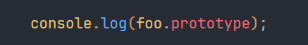

# 原型链

# 了解下背景

首先我们要明确的是，在JavaScript被设计出来时，就有了原型链机制，这是JavaScript的语言核心特性之一。

**记住这点，以后会考**：在JavaScript的第一个版本中就定义了每个对象都有一个内部属性`Prototype`​

其次，在JavaScript这个语言中，有两个非常重要的概念

1. 一切皆对象
2. 函数是一等公民（一级对象）

---

JS总有八种基本的数据类型

其中原始数据类型（基本数据类型）

1. Number类型
2. BigInt类型
3. String类型
4. Boolean类型
5. null值
6. undefined值
7. Symbol类型

一种非原始数据类型（复杂数据类型）

8. Object类型

这是我们在使用JS编程中最常使用到的数据类型，那我们结合第一点：一切皆对象。

我们只有一种非原始数据类型`Object`​，这也可以叫复杂数据类型，也可以叫引用类型，怎么记随便，这只是个称呼。

那`Array`​、`Function`​、`Date`​、`RegExp`​、`Map`​、`Set`​等等这些东西，本质上都是对象。

需要注意的是，一切皆对象的“一切”，指的是一切引用类型

# 构造函数是什么？

上面我们说到，函数是一等公民，所谓构造函数，其实和普通函数没有什么区别，只不过构造函数前经常使**用new来创建对象**，任何一个函数都可以当做构造函数。所以可以总结出第一条规则

- new + 构造函数 = 对象

我们上面所说道的`Array`​、`Function`​、`Date`​、`RegExp`​、`Map`​、`Set`​都是构造函数，通过`new`​ + 构造函数可以创建一个特定类型的对象。

现在我们来创建一个我们自己的构造函数

首先我们使用function创建了一个`foo`​函数，然后我们使用`new`​关键字创建了一个新的函数`bar`​，最终我们调用bar.name和bar.greet()；你可以发现bar是可以正常运行的

> 看到这你可以会想说：“讲的什么玩意，这和原型链有关系吗？！我****👺”
>
> 先别着急，本项目岂在引导理解，而非上来给你讲一堆名词，能达到的效果也是让你有基本理解。请继续看下去吧，最后你会恍然大悟。

我们再输出一下foo和bar的类型，我们可以发现，`bar`​的类型是`object`​，而`foo`​的类型是`function`​；这是为什么呢？

OK，不要再想了，上面说道过：“通过`new`​ + 构造函数可以创建一个特定类型的对象。”，你现在就可以粗略的理解使用`new`​关键字调用的构造函数，最终返回的都是一个**对象**

# 原型链

## 访问对象的原型

要了解原型链，就要了解什么是对象

**对象就是是属性的集合**

当你去翻译属性的英文时，会有以下几种翻译

- attribute：名词：属性，特征，特性

  - 用于描述人或事物固有的、可被客观观察的特征，**但未必是本质属性**
- property：名词：所有物；财产

  - 用于描述某物自然具有的质量或特性，**尤指重要的或决定其行为的本质属性**

在计算机领域中，对于描述对象中的属性，使用peoperty再合适不过了

---

那原型的翻译是啥呢：prototype

它是个名词，意为：原型、雏形、最初形态、样机、样品、典范、模型

所以原型链，你可以把它理解为雏形链、最初形态链，原型这个翻译还是比较信达雅的。

OK，让我们继续，我们有了`foo`​和`bar`​，而bar是一个对象，对象上都有一个内部属性`[[Protytype]]`​，让我们访问一下这个属性看看

需要注意是是，对象在访问它的原型时，需要使用`__proto__`​使用，至于为什么使用这东西访问，而不是Prototype访问，因为这是个对象啊bro，你能保证你的对象中没有prototype这个键吗，在JavaScript没有实现私有变量的时候，大家默认以`__`​或`_`​为开头的变量为私有变量。

它输出了什么呢？

它输出了一个`{}`​！这是为什么？

## 构造对象的流程

让我们重新梳理一下整个流程，`bar`​是通过`new foo()`​创建的对象，**这时候就不要把foo当成普通函数了**，你就把foo理解为构造函数吧，我们使用`foo`​构造了一个`bar`​对象。

那我们在使用foo构造bar对象时，发生了什么呢？

或者说

在使用构造函数构造对象时，值是如何传递给bar的？

> 你还记得函数是一等公民吗，这个概念还是太抽象，结合第一点：JS中一切引用类型皆为对象，所以函数也是个对象，一等公民就是一个非常厉害的对象而已

废话少说了：当我们使用了构造函数创建对象时，新对象的`[[Prototype]]`​会被设置为构造函数的`prototype`​属性。

那我们有对`foo`​这个非常厉害的对象手动添加了`prototype`​的属性吗？没有！`prototype`​默认值就是个空对象。、

让我们输出一下`foo.prototype`​

它也输出了一个`{}`​

再让我们对比一下`foo.prototype`​和`bar.__proto__`​, 他们是一个东西

然我们在`foo`​的`prototype`​上显示添加些东西试一试

让我们输出一下`foo.prototype`​和`bar.__proto__`​

现在不是空对象了，因为我们显式的对prototype添加了属性

## 访问顺序

你可能注意到了，我在原型对象上添加了一个属性`name`​，而我们的`foo`​中也添加了`name`​，那么使用`bar.name`​会输出什么呢？

它输出了`foo`​

原型对象上还有一个名为`hello`​的方法，而`bar`​本身没有这个方法，我们调用`bar.hello()`​会有效吗？

有的兄弟！有的！

那是因为对象的访问属性时，会优先在自己内部寻找，如果找不到了才会沿着原型链去寻找。

因为`bar`​内部有`name`​属性，所以在输出时，它不会去访问原型上的`name`​属性

因为`bar`​内部没有`hello`​属性，它会沿着原型链向上寻找，原型上有，就调用原型上的`hello()`​

---

# 原型链的尽头是什么？

可以说在JavaScript中，`Function()`​和`Object()`​是最重要的两个构造函数，结合函数也是对象这个特点。

我们可以知道一个函数的原型也是个对象，那这个对象是如何出现的呢？

对象当然是由对象的构造函数构造出来的，那对象的构造函数也是个对象，这个对象也是由对象的构造函数构造出来的。你看看你后面呢？你再看看你后面呢？

奇怪，这不就是个大循环了吗？

​

但实际不是的，为了防止这种情况的出现，`Object.prototype.__proto__ `​是 `null`​，这就是它的逃跑路线！

这样就能方式原型链无限循环了

实际上它长这样

Great！这就是原型链，很简单吧。最后我们做一个总结吧

# 总结

- 在JavaScript中，一切的引用类型都是对象
- 函数是一等公民（一级对象）
- 访问原型对象时

  - 函数通过`.prototype`​访问
  - 对象通过`.__proto__`​访问
- 我们可以在原型上显示的添加属性
- Object()构造函数的原型对象的原型是null

  ‍

‍

‍
