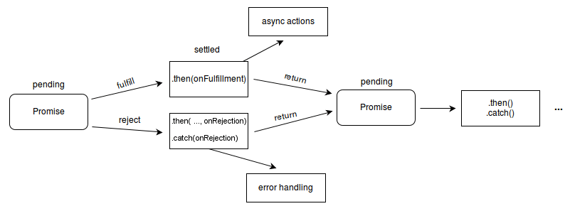

# Promise

<span data-type="text" style="color: var(--b3-font-color13);">Promise 是在 </span>**ES2015（ES6）**  版本被正式引入 JavaScript 的。在此之前，处理异步操作主要依靠**回调函数**，这种方式容易造成 “回调地狱”（Callback Hell）。Promise 的出现，让异步代码的写法更具结构化，也更便于阅读和维护。

网络请求、文件读取、定时器等都是异步操作

<span data-type="text" style="color: var(--b3-font-color13);">Promise的出生是为了更优雅的解决回调地域</span>

**<span data-type="text" style="color: var(--b3-font-color13);">当一个函数的执行需要依赖于另一个函数的结果时，就需要用到回调函数</span>**



Promise是一个**构造函数**，所以在创建一个Promise时，需要使用`new Promise(fn)`​​来创建，这个构造函数接收一个函数参数，这个函数又接受两个参数(resolve,reject)，分别对应着成功时的回调和失败时的回调,这两个参数是Promise内置的，用于返回Promise的状态


**其实你就可以简单的理解为，Promise就是它答应了你一件事，它去做这件事，这件事做成他会通知你，没做成它也会通知你，无论如何它都会给你反馈，事事有反馈。你可以根据它的反馈来决定后面的操作。**

在Promise实例上存在三个实例方法，then、catch、finally，分别对应着成功时进行的操作，失败时进行操作，无论如何都会进行的操作，每个then方法都会返回一个Promise对象，所以then可以链式调用

### 静态方法

[`Promise.all()`](https://developer.mozilla.org/zh-CN/docs/Web/JavaScript/Reference/Global_Objects/Promise/all)​接受一个 Promise 可迭代对象作为输入，并返回单个 `Promise`​。返回的 Promise 在所有输入的 Promise 都兑现时（包括传入的可迭代对象为空时）被兑现，其值为一个包含所有兑现值的数组。如果输入的任何 Promise 被拒绝，返回的 Promise 也会被拒绝，并返回第一个拒绝的原因。

[`Promise.allSettled()`](https://developer.mozilla.org/zh-CN/docs/Web/JavaScript/Reference/Global_Objects/Promise/allSettled)​接受一个 Promise 可迭代对象作为输入，并返回单个 `Promise`​。返回的 Promise 在所有输入的 Promise 都敲定时兑现（包括传入的可迭代对象为空时），其值为一个描述每个 Promise 结果的对象数组。

[`Promise.any()`](https://developer.mozilla.org/zh-CN/docs/Web/JavaScript/Reference/Global_Objects/Promise/any)​接受一个 Promise 可迭代对象作为输入，并返回单个 `Promise`​。返回的 Promise 在任何输入的 Promise 兑现时兑现，其值为第一个兑现的值。如果所有输入的 Promise 都被拒绝（包括传入的可迭代对象为空时），返回的 Promise 将以带有一个包含拒绝原因的数组的 [`AggregateError`](https://developer.mozilla.org/zh-CN/docs/Web/JavaScript/Reference/Global_Objects/AggregateError)​ 拒绝。

[`Promise.race()`](https://developer.mozilla.org/zh-CN/docs/Web/JavaScript/Reference/Global_Objects/Promise/race)​接受一个 Promise 可迭代对象作为输入，并返回单个 `Promise`​。返回的 Promise 与第一个敲定的 Promise 的最终状态保持一致。

[`Promise.reject()`](https://developer.mozilla.org/zh-CN/docs/Web/JavaScript/Reference/Global_Objects/Promise/reject)​返回一个新的 `Promise`​ 对象，该对象以给定的原因拒绝。

[`Promise.resolve()`](https://developer.mozilla.org/zh-CN/docs/Web/JavaScript/Reference/Global_Objects/Promise/resolve)​返回一个新的 `Promise`​ 对象，该对象以给定的值兑现。如果值是一个 thenable 对象（即具有 `then`​ 方法），则返回的 Promise 对象会“跟随”该 thenable 对象，采用其最终的状态；否则，返回的 Promise 对象会以该值兑现。

通常，如果你不知道一个值是否是 Promise，那么最好使用 [`Promise.resolve(value)`](https://developer.mozilla.org/zh-CN/docs/Web/JavaScript/Reference/Global_Objects/Promise/resolve)​ 将其转换成 Promise 对象，并将返回值作为 Promise 来处理。

### 使用示例

```js
let result = {
    code:200,
    message:"success"
}
// Promise接受一个函数参数，这个函数参数又接受两个函数参数，分别是resolve和reject，
// 这两个参数是Promise内置的两个函数，用来改变Promise的状态。
const promise = new Promise((resolve,reject)=>{

    if(result.code == 200){
        resolve(result)
    }
    else{
        reject(result)
    }
})

promise.then((result)=>{
    console.log(result.message);
    
})
.catch((result)=>{
    console.log(result);
})
```

# async和await（您可以选择性观看）

**async/await（2017 年，ES8/ES2017）**

- **标准化时间**：<span data-type="text" style="color: var(--b3-font-color13);">ES2017（ES8）</span>引入 `async`​ 和 `await`​ 关键字。
- **核心作用**：基于 Promise 的语法糖，用同步写法处理异步逻辑。

**async函数永远只返回一个Promise，如果async函数不返回值，那不如不用**

async定义的函数有隐式返回，例如

```js
  async function bb(){
        return '别bb，专心学习！';
	}
相当于
  async function bb(){
        return Promise.resolve('别bb，专心学习！');
	}
```

async会自动将return的东西包装成Promise对象

## await

- 不能单独使用，只能和async配合使用
- await只能基于promise使用

`await`​ 操作符用于等待一个 [`Promise`](https://developer.mozilla.org/zh-CN/docs/Web/JavaScript/Reference/Global_Objects/Promise)​ 兑现并获取它兑现之后的值。它只能在[异步函数](https://developer.mozilla.org/zh-CN/docs/Web/JavaScript/Reference/Statements/async_function)或者[模块](https://developer.mozilla.org/zh-CN/docs/Web/JavaScript/Guide/Modules)顶层中使用。

**await实际上等待的是一个表达式**

所以有两种情况

1. 等待一个async函数，实际上就是等待返回的Promise对象，这也是最常用的
2. 若表达式的值不是 Promise，await 会把该值转换为已兑现的 Promise，然后返回其结果。

```js
async function f3() {
  const y = await 20;
  console.log(y); // 20

  const obj = {};
  console.log((await obj) === obj); // true
}

f3();

```

这是一个await阻塞函数的示例

```js

const  delayHandler = async () => {
    console.log(new Date().toISOString());
    
    return new Promise((resolve,reject) => {
        setTimeout(() => {
            console.log("'这是3秒后的输出'");
            
            resolve();
        },3000);
    })
}

async function test(){
    console.log('test函数开始执行');
    await delayHandler();

    console.log('test函数执行结束');
    
}

test();
```
