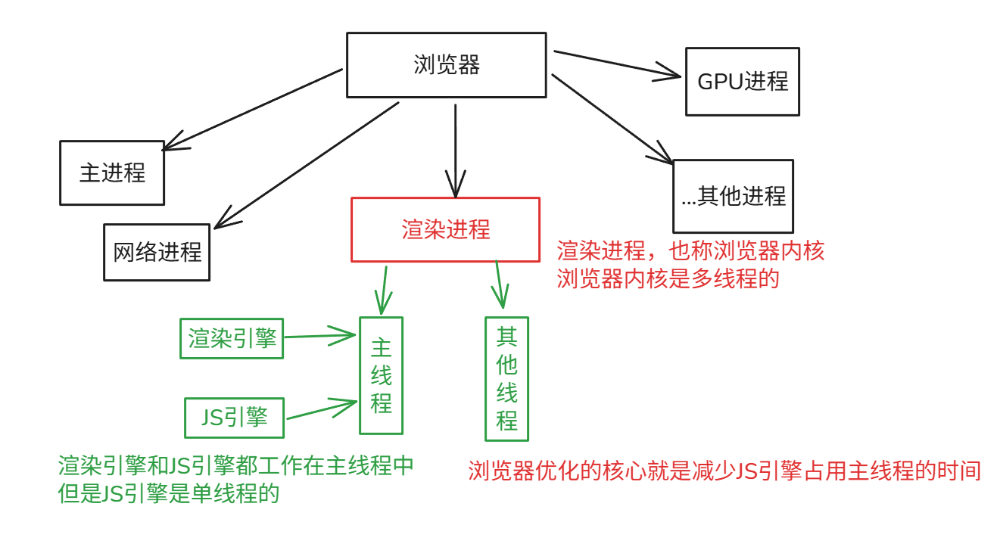

# 浏览器执行机制

在同一时间内，渲染引擎和JS引擎只有一个能工作。

​

那当为什么使用`setTimeout`​时，是在干什么呢？

使用setTimeout就表明了JS要执行一个耗时的操作，不要JS在主线程阻塞，此时这个任务就被推到任务队列中，计时器线程开始计时，计时时间到了，这个操作就被推送到任务队列中。

主线程空闲时会检查任务队列，查看是否有待办的任务

# 任务队列

任务队列中现代浏览器中很复杂

任务队列中的任务也被分为多种

- 微任务（优先级高）
- 交互任务（优先级中）
- 延迟任务（优先级低）

# 当你在本地打开了一个html文件，浏览器干了什么？

1. 浏览器检测到你输入了一个本地文件地址，于是开始读取文件的内容，对于浏览器来说，html文件就是一堆字符串
2. 主进程拿到字符串后，将字符串打包成一个渲染任务放进任务队列
3. 主线程中空闲时会不断的轮训任务队列，当有渲染任务时，由渲染引擎开始解析HTML。

    1. 生成DOM Tree
    2. 生产CSSOM Tree
    3. 布局
    4. 分层
    5. 绘图
    6. 分块
    7. 光栅化
    8. 绘制
4. 当解析到了scrpit标签，就打包一个script任务放进任务队列，同时将渲染引擎挂起
5. 渲染引擎挂起后，主线程就闲置了，轮询到了一个script任务，开始由JS引擎执行script任务

‍
